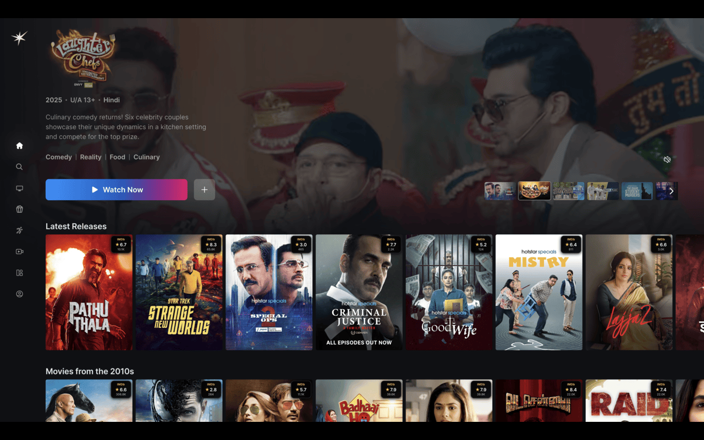

# 🎬 IMDBuddy - Smart Ratings for Streaming Platforms

A Chrome extension that displays **IMDb**, **Rotten Tomatoes**, and **Metascore** ratings directly on streaming platforms like Netflix, Hotstar, Prime Video, and Disney+.



## ✨ Features

- **🎯 Multi-Source Ratings**: See IMDb, Rotten Tomatoes, and Metascore scores
- **🚀 Real-Time Data**: Live ratings from trusted sources via OMDB API
- **🎨 Beautiful UI**: Modern, non-intrusive overlay design
- **⚡ Smart Caching**: 30-day cache for faster loading
- **🔍 Smart Matching**: Advanced fuzzy matching for accurate title detection
- **📱 Responsive**: Works on all screen sizes
- **🔄 Auto-Detection**: Automatically works on supported platforms

## 🎯 Supported Platforms

| Platform | Status | Rating Display |
|----------|--------|----------------|
| **Netflix** | ✅ Working | Movie/show cards |
| **Hotstar** | ✅ Working | Content tiles |
| **Prime Video** | ✅ Working | Amazon content |
| **Disney+** | ✅ Working | Disney & Star content |

## 🚀 Quick Start

### 1. Clone the Repository
```bash
git clone https://github.com/yourusername/IMDBuddy.git
cd IMDBuddy
```

### 2. Get Your Free API Key
1. Visit [OMDB API](http://www.omdbapi.com/)
2. Click "Get a free API key"
3. Fill out the simple form (name, email)
4. Check your email for the API key

### 3. Configure the Extension
1. Open `content.js`
2. Find this line: `const OMDB_API_KEY = 'YOUR_OMDB_API_KEY';`
3. Replace `'YOUR_OMDB_API_KEY'` with your actual API key
4. Save the file

### 4. Install in Chrome
1. Open Chrome and go to `chrome://extensions/`
2. Enable "Developer mode" (top-right toggle)
3. Click "Load unpacked"
4. Select the IMDBuddy folder
5. The extension will appear in your toolbar

### 5. Test It Out
1. Visit [Netflix](https://netflix.com)
2. Browse any movie/show section
3. Look for rating overlays on content cards
4. You should see ratings like:
   ```
   IMDb    ⭐ 8.5    1.2M votes
   RT      🍅 89%    Critic
   MC      📊 85     Critic
   ```

## 📊 Rating Sources

### IMDb Ratings
- **Source**: User ratings from millions of moviegoers
- **Scale**: 1-10 stars
- **Icon**: ⭐ Gold star
- **Color**: #f5c518 (IMDb yellow)

### Rotten Tomatoes
- **Source**: Critic scores
- **Scale**: 0-100%
- **Icon**: 🍅 Tomato
- **Color**: #fa320a (RT red)

### Metascore
- **Source**: Critic aggregator
- **Scale**: 0-100
- **Icon**: 📊 Chart
- **Color**: #00b894 (Green)

## 🛠️ Technical Details

### Architecture
- **Platform Agnostic**: Single codebase works across all streaming platforms
- **Modular Design**: Separate modules for API, UI, and platform detection
- **Smart Caching**: 30-day cache with automatic cleanup
- **Rate Limiting**: Respects API limits with exponential backoff

### APIs Used
- **OMDB API**: Free API providing IMDb, RT, and Metascore ratings
- **Rate Limit**: 1,000 requests per day (free tier)

### Performance Features
- **Concurrent Requests**: Fetches multiple ratings simultaneously
- **Debounced Updates**: Prevents excessive API calls
- **Memory Efficient**: Automatic cleanup of processed elements

## 🔧 Configuration

### Base Configuration
```javascript
const BASE_CONFIG = {
    REQUEST_DELAY: 110, // Rate limiting
    STORAGE_KEY: 'ratings_cache',
    MIN_MATCH_SCORE: 0.7, // Fuzzy matching threshold
    CACHE_MAX_AGE: 30 * 24 * 60 * 60 * 1000, // 30 days
    MAX_CONCURRENT_REQUESTS: 5
};
```

### Adding New Platforms
```javascript
const newPlatform = {
    name: 'New Platform',
    hostnames: ['newplatform.com'],
    cardSelectors: ['.content-card'],
    titleSelectors: ['.title'],
    imageContainerSelectors: ['.image-container'],
    extractTitle: (element, selectors) => {
        // Custom title extraction logic
        return { title: 'Title', type: 'movie' };
    }
};
```

## 🎨 Customization

### Styling
Customize the overlay appearance in `styles.css`:

```css
.ratings-overlay {
    /* Main overlay styles */
    background: linear-gradient(135deg, rgba(0,0,0,0.9), rgba(0,0,0,0.75));
    backdrop-filter: blur(10px);
}

.imdb-rating .rating-logo {
    color: #f5c518; /* IMDb yellow */
}

.rt-rating .rating-logo {
    color: #fa320a; /* RT red */
}

.meta-rating .rating-logo {
    color: #00b894; /* Metascore green */
}
```

## 🐛 Troubleshooting

### Common Issues

#### Ratings Not Showing
1. **Check API Key**: Ensure your OMDB API key is correct
2. **Check Console**: Open DevTools (F12) and look for error messages
3. **Test API**: Visit `http://www.omdbapi.com/?apikey=YOUR_KEY&t=Inception`
4. **Clear Cache**: Click the extension icon and clear cache

#### Incorrect Ratings
1. **Title Matching**: Check if the extracted title is correct
2. **API Response**: Verify the API is returning correct data
3. **Platform Support**: Ensure you're on a supported platform

#### Performance Issues
1. **Reduce Requests**: Lower `MAX_CONCURRENT_REQUESTS` in config
2. **Clear Cache**: Remove stored data to reset
3. **Check Rate Limits**: Ensure you haven't exceeded API limits

### Debug Mode
Enable debug logging by opening browser console and looking for:
```
IMDBuddy initialized for Netflix
Processing card with title data: {title: "Movie Title", type: "movie"}
Received ratings: {imdb: {...}, omdb: {...}}
```

## 📁 Project Structure

```
IMDBuddy/
├── content.js          # Main extension logic
├── popup.html          # Extension popup interface
├── styles.css          # Overlay and popup styling
├── manifest.json       # Extension configuration
├── README.md           # This file
├── SETUP.md            # Setup instructions
├── LICENSE             # MIT License
└── images/
    ├── icon.png        # Extension icon
    └── demo.png        # Demo screenshot
```

## 🤝 Contributing

We welcome contributions! Here's how to get started:

1. **Fork the repository**
2. **Create a feature branch**: `git checkout -b feature/amazing-feature`
3. **Make your changes**
4. **Test on multiple platforms**
5. **Commit your changes**: `git commit -m 'Add amazing feature'`
6. **Push to the branch**: `git push origin feature/amazing-feature`
7. **Open a Pull Request**

### Development Setup
1. Clone the repository
2. Get an OMDB API key
3. Update `content.js` with your API key
4. Load as unpacked extension in Chrome
5. Test on streaming platforms

## 📄 License

This project is licensed under the MIT License - see the [LICENSE](LICENSE) file for details.

## 🙏 Acknowledgments

- **OMDB API**: For providing free movie data
- **IMDb**: For the rating system concept
- **Rotten Tomatoes**: For critic ratings
- **Metacritic**: For aggregated scores
- **Streaming Platforms**: For the content that makes this useful

## 📞 Support

- **Issues**: [GitHub Issues](https://github.com/yourusername/IMDBuddy/issues)
- **Discussions**: [GitHub Discussions](https://github.com/yourusername/IMDBuddy/discussions)
- **Contact**: [@the2ndfloorguy](https://x.com/intent/user?screen_name=the2ndfloorguy)

## 🌟 Star History

[](https://star-history.com/#yourusername/IMDBuddy&Date)

---

**Made with ❤️ for the streaming community**

**Version**: 4.0.0  
**Last Updated**: December 2024